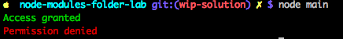

# Importing Folders (Proxy for Modules)

## Objectives

1. Implement a folder as a proxy for modules
1. Create files in a folder, files with exports
1. Import files/modules from another file via folder "proxy"

## Introduction

In this lab, you'll learn how to proxy folders or in other words how to create an abstraction layer which will allow you to group files using the Node feature of importing folders.

## Instructions

1. Create a proxy file `index.js` in the `color-logs` folder
2. Import all the files in the `color-logs` folder in the `index.js` (except `index.js obviously)
3. Export the imported file as an object. Follow the  `module.exports = {...} pattern with filenames as values of properties (see extra info if this is too confusing)
4. Create `main.js` in the repository folder and import the `color-logs` folder
5. Print two lines: "Access granted" with green color and "Permission denied" with red.
6. Bonus: refactor `index.js` to process an unlimited number of files from the `color-logs` folder with `fs.

### Extra Info



This code is **not** the exact code which you need to put in `index.js`. This snippet just an example. Use it as inspiration for the real `index.js` file:

```js
module.exports = {
  banana: require('./banana.js'),
  orange: require('./orange.js'),
  ...
  passionFruit: require('./passion-fruit.js')
}
```


* [Printing colorful text in terminal when run node js script](https://coderwall.com/p/yphywg/printing-colorful-text-in-terminal-when-run-node-js-script)
* [How to get colors on the command line](https://docs.nodejitsu.com/articles/command-line/how-to-get-colors-on-the-command-line)
* [node.js require all files in a folder?](http://stackoverflow.com/questions/5364928/node-js-require-all-files-in-a-folder)
* [Converting any string into camel case](http://stackoverflow.com/questions/2970525/converting-any-string-into-camel-case)